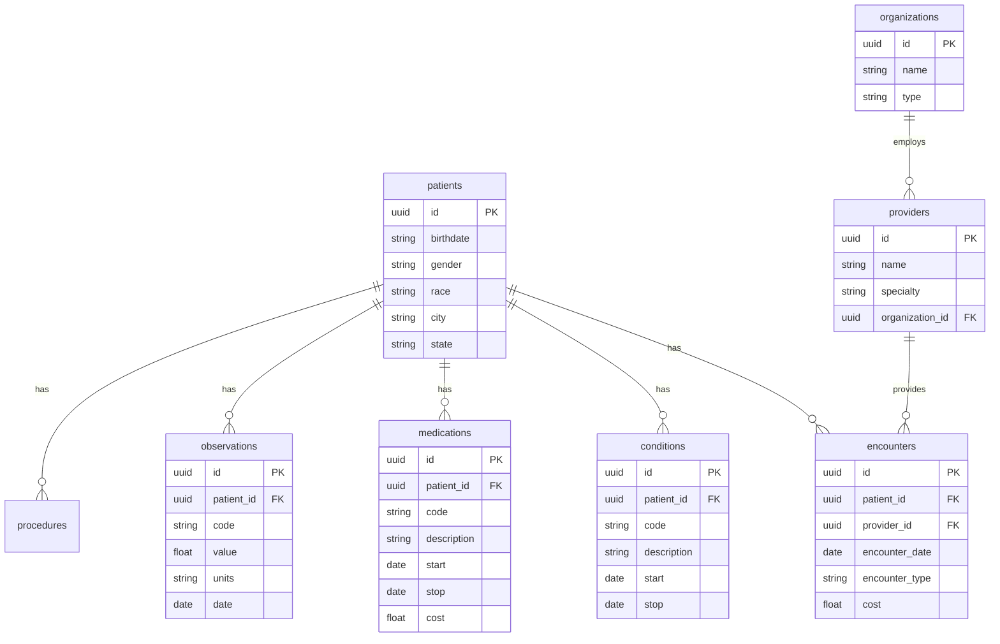
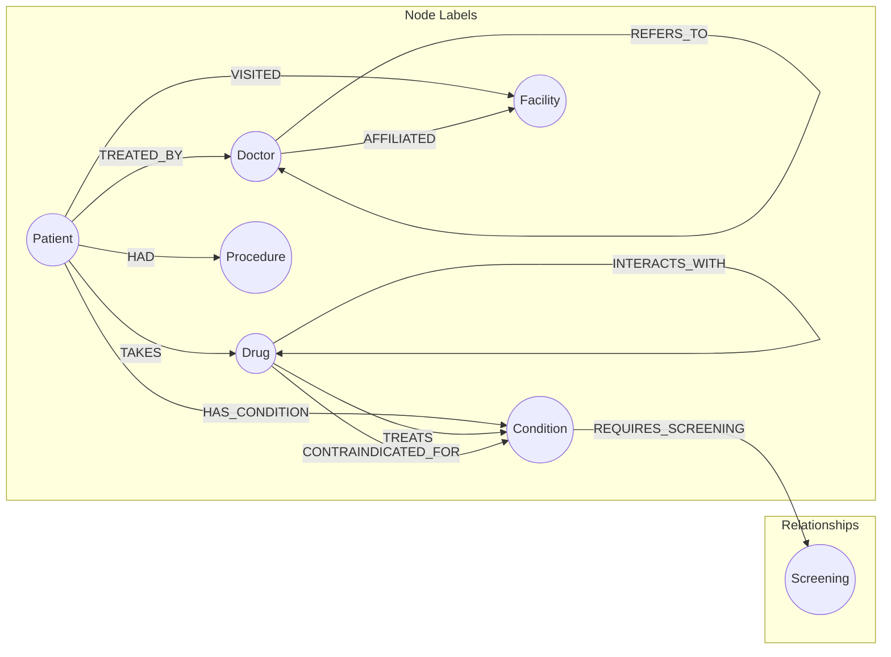

# Healthcare Multi-Model Database Project

**Project scope:** This repository implements **Use Case 1: Comprehensive Drug Safety Check**. The sections below describe that use case in detail (data sources, queries, schema) and, for context, document additional use cases that could extend the application.

---

## Overview

This project demonstrates how **three different database paradigms** work **together** to solve one healthcare problem: checking drug safety when prescribing a new medication. The implemented application uses **all three databases** (PostgreSQL, Neo4j, Qdrant) on the **same underlying patient data**.

| Database | Type | Role in Each Use Case |
|----------|------|----------------------|
| **PostgreSQL** | Relational | Structured data retrieval, aggregations, transactions |
| **Neo4j** | Graph | Relationship traversal, network analysis, pathfinding |
| **Qdrant** | Vector | Semantic search, similarity matching, embeddings |

---

## Architecture

```
┌─────────────────────────────────────────────────────────────────┐
│                     SAME SOURCE DATA                            │
│            (Synthea Synthetic Patient Records)                  │
└─────────────────────┬───────────────────────────────────────────┘
                      │
        ┌─────────────┼─────────────┐
        ▼             ▼             ▼
┌───────────────┬───────────────┬───────────────┐
│  PostgreSQL   │    Neo4j      │    Qdrant     │
│   (Tables)    │   (Graph)     │  (Vectors)    │
├───────────────┼───────────────┼───────────────┤
│ - patients    │ - Patient     │ - note        │
│ - conditions  │ - Doctor      │   embeddings  │
│ - medications │ - Drug        │ - patient     │
│ - encounters  │ - Condition   │   profiles    │
│ - observations│ - Facility    │ - medical     │
│ - procedures  │               │   knowledge   │
└───────────────┴───────────────┴───────────────┘
        │             │             │
        └─────────────┼─────────────┘
                      ▼
            ┌─────────────────┐
            │  Application    │
            │  (Unified API)  │
            └─────────────────┘
```

---

## Master Data Sources Reference

| Data Source | URL | License | Data Type | Use Cases |
|-------------|-----|---------|-----------|-----------|
| **Synthea** | https://synthetichealth.github.io/synthea/ | Apache 2.0 | Synthetic EHR (patients, encounters, conditions, meds) | All 15 |
| **DrugBank Open** | https://go.drugbank.com/releases/latest#open-data | CC BY-NC 4.0 | Drug interactions, properties | 1, 5, 9, 10 |
| **SIDER** | http://sideeffects.embl.de/ | CC BY-NC-SA | Drug side effects | 1, 9 |
| **openFDA** | https://open.fda.gov/apis/ | Public Domain | Adverse events, drug labels | 1, 9 |
| **ClinicalTrials.gov** | https://clinicaltrials.gov/data-api | Public Domain | Trial eligibility, outcomes | 7 |
| **MIMIC-IV** | https://physionet.org/content/mimiciv/ | PhysioNet (credentialed) | Real ICU data | 3, 10, 13 |
| **PubMed/MEDLINE** | https://pubmed.ncbi.nlm.nih.gov/ | Public Domain | Medical literature | 4, 5, 12, 15 |
| **UMLS/SNOMED-CT** | https://www.nlm.nih.gov/research/umls/ | UMLS License | Medical ontology | 6, 11, 12 |
| **ICD-10-CM** | https://www.cms.gov/medicare/coding/icd10 | Public Domain | Diagnosis codes | All |
| **RxNorm** | https://www.nlm.nih.gov/research/umls/rxnorm/ | UMLS License | Drug terminology | 1, 5, 9 |
| **NPI Registry** | https://npiregistry.cms.hhs.gov/ | Public Domain | Provider data | 2, 8 |
| **HCAHPS** | https://data.cms.gov/provider-data/ | Public Domain | Patient satisfaction surveys | 8 |
| **CMS Claims (DE-SynPUF)** | https://www.cms.gov/data-research/statistics-trends-and-reports/medicare-claims-synthetic-public-use-files | Public Domain | Synthetic Medicare claims | 14 |
| **HealthData.gov** | https://healthdata.gov/ | Various | Public health datasets | 6 |
| **MedQuAD** | https://github.com/abachaa/MedQuAD | Public | Medical Q&A pairs | 15 |

---

## Integrated Use Cases (All 3 Databases Per Use Case)

Each use case below demonstrates how PostgreSQL, Neo4j, and Qdrant work **together** to solve a healthcare problem that no single database could solve alone.

---

### Use Case 1: Comprehensive Drug Safety Check

**Problem:** When prescribing a new medication, check for interactions with current drugs AND find similar patients who had adverse reactions.

**Data Sources:**
| Source | What It Provides | Database Target |
|--------|------------------|-----------------|
| **Synthea** | Patient medications list | PostgreSQL |
| **DrugBank Open** | Drug-drug interaction pairs with severity | Neo4j |
| **openFDA FAERS** | Real adverse event reports | Qdrant (embeddings) |
| **SIDER** | Known drug side effects | Neo4j |

| Step | Database | Query | Purpose |
|------|----------|-------|---------|
| 1 | **PostgreSQL** | `SELECT * FROM medications WHERE patient_id = 'P1' AND end_date IS NULL` | Get patient's current active medications |
| 2 | **Neo4j** | `MATCH (d1:Drug)-[i:INTERACTS]->(d2:Drug) WHERE d1.name IN $current_meds AND d2.name = $new_drug RETURN i.severity` | Check all drug-drug interactions in graph |
| 3 | **Qdrant** | `search(collection='adverse_events', vector=patient_profile, filter={drug: new_drug})` | Find similar patients who had adverse events with this drug |

**Combined Result:** "WARNING: New drug has MODERATE interaction with Aspirin. Additionally, 3 patients with similar profiles (age 65+, diabetic) reported dizziness. Consider alternative or monitor closely."

---

### Use Case 2: Intelligent Specialist Referral

**Problem:** Find the best specialist for a patient based on similar patient outcomes and optimal referral path.

**Data Sources:**
| Source | What It Provides | Database Target |
|--------|------------------|-----------------|
| **Synthea** | Patient demographics, conditions, encounters | PostgreSQL |
| **NPI Registry** | Provider details, specialties, locations | PostgreSQL + Neo4j |
| **Synthea** | Provider-patient encounters (for referral network) | Neo4j |
| **Synthea** | Treatment outcomes | Qdrant (patient profiles) |

| Step | Database | Query | Purpose |
|------|----------|-------|---------|
| 1 | **PostgreSQL** | `SELECT * FROM patients p JOIN conditions c ON p.id = c.patient_id WHERE p.id = 'P1'` | Get patient demographics and conditions |
| 2 | **Qdrant** | `search(collection='patient_outcomes', vector=patient_profile, top_k=50)` | Find 50 most similar patients |
| 3 | **PostgreSQL** | `SELECT specialist_id, AVG(outcome_score) FROM treatments WHERE patient_id IN ($similar_ids) GROUP BY specialist_id ORDER BY AVG DESC` | Which specialists had best outcomes for similar patients |
| 4 | **Neo4j** | `MATCH path = shortestPath((pcp:Doctor {id: $current_doctor})-[:REFERS_TO*]-(spec:Doctor {id: $best_specialist})) RETURN path` | Find optimal referral path to that specialist |

**Combined Result:** "Dr. Sarah Chen (Endocrinologist) has 92% success rate with patients like yours. Referral path: Your PCP → Internal Medicine → Dr. Chen (2 steps, avg wait 5 days)."

---

### Use Case 3: Readmission Risk Prediction

**Problem:** Predict if a patient is at risk of 30-day readmission by analyzing history, care gaps, and similar patient patterns.

**Data Sources:**
| Source | What It Provides | Database Target |
|--------|------------------|-----------------|
| **Synthea** | Hospitalization history, encounters | PostgreSQL |
| **MIMIC-IV** (optional) | Real ICU readmission data | PostgreSQL + Qdrant |
| **Synthea** | Provider-patient relationships | Neo4j |
| **CMS Hospital Readmissions** | Readmission benchmarks | PostgreSQL |

| Step | Database | Query | Purpose |
|------|----------|-------|---------|
| 1 | **PostgreSQL** | `SELECT * FROM encounters WHERE patient_id = 'P1' AND type = 'inpatient' ORDER BY date DESC` | Get hospitalization history, diagnoses, length of stay |
| 2 | **Neo4j** | `MATCH (p:Patient {id: 'P1'})-[:TREATED_BY]->(d:Doctor) WITH collect(d) as team MATCH (p)-[:HAS_CONDITION]->(c) WHERE NOT exists((team)-[:SPECIALIZES_IN]->(c)) RETURN c` | Identify care team gaps (conditions without matching specialists) |
| 3 | **Qdrant** | `search(collection='patient_profiles', vector=discharge_profile, filter={readmitted_30_days: true})` | Find similar patients who were readmitted within 30 days |
| 4 | **PostgreSQL** | `SELECT COUNT(*) * 100.0 / (SELECT COUNT(*) FROM similar_patients) as readmission_rate FROM similar_patients WHERE readmitted = true` | Calculate readmission rate among similar patients |

**Combined Result:** "HIGH RISK (78%): Similar patients had 78% readmission rate. Care gap detected: No cardiologist on care team despite heart failure diagnosis. Recommend: Cardiology consult before discharge."

---

### Use Case 4: Clinical Note Search with Context

**Problem:** Find relevant clinical notes semantically, then provide full patient context and related cases.

**Data Sources:**
| Source | What It Provides | Database Target |
|--------|------------------|-----------------|
| **Synthea** | Clinical notes (from encounters) | PostgreSQL + Qdrant |
| **MIMIC-IV** (optional) | Real clinical notes | Qdrant (embeddings) |
| **PubMed** | Medical literature for context | Qdrant |
| **UMLS/SNOMED-CT** | Condition relationships (comorbidities) | Neo4j |

| Step | Database | Query | Purpose |
|------|----------|-------|---------|
| 1 | **Qdrant** | `search(collection='clinical_notes', vector=embed("diabetic patient with recurring fatigue and weight gain"), top_k=20)` | Semantic search finds notes about similar symptoms (not just keywords) |
| 2 | **PostgreSQL** | `SELECT p.*, c.*, m.* FROM patients p JOIN conditions c ON p.id = c.patient_id JOIN medications m ON p.id = m.patient_id WHERE p.id IN ($note_patient_ids)` | Get full structured data for patients whose notes matched |
| 3 | **Neo4j** | `MATCH (p:Patient)-[:HAS_CONDITION]->(c:Condition)-[:COMMONLY_COMORBID]->(c2:Condition) WHERE p.id IN $patient_ids RETURN c2, count(*) as frequency ORDER BY frequency DESC` | Find commonly co-occurring conditions in these patients |

**Combined Result:** "Found 20 relevant notes. Common pattern: 15/20 patients also had hypothyroidism (often missed in diabetics). Recommend: Check TSH levels."

---

### Use Case 5: Treatment Recommendation Engine

**Problem:** Recommend treatments based on what worked for similar patients, with safety checks.

**Data Sources:**
| Source | What It Provides | Database Target |
|--------|------------------|-----------------|
| **Synthea** | Patient profiles, treatment history | PostgreSQL |
| **DrugBank Open** | Drug interactions, contraindications | Neo4j |
| **PubMed** | Treatment effectiveness literature | Qdrant |
| **RxNorm** | Drug classification, alternatives | Neo4j |
| **Synthea** | Treatment outcomes | Qdrant (patient embeddings) |

| Step | Database | Query | Purpose |
|------|----------|-------|---------|
| 1 | **PostgreSQL** | `SELECT * FROM patients p JOIN conditions c ON p.id = c.patient_id JOIN medications m ON p.id = m.patient_id WHERE p.id = 'P1'` | Get complete patient profile |
| 2 | **Qdrant** | `search(collection='patient_outcomes', vector=patient_profile, filter={condition: 'diabetes', outcome: 'improved'}, top_k=100)` | Find 100 similar patients whose diabetes improved |
| 3 | **PostgreSQL** | `SELECT treatment, COUNT(*) as count, AVG(improvement_score) as avg_improvement FROM treatments WHERE patient_id IN ($similar_ids) GROUP BY treatment ORDER BY avg_improvement DESC` | Rank treatments by effectiveness in similar patients |
| 4 | **Neo4j** | `MATCH (d:Drug {name: $top_treatment})-[i:INTERACTS]->(d2:Drug) WHERE d2.name IN $patient_current_meds RETURN d2.name, i.severity` | Check if top treatment interacts with patient's current meds |
| 5 | **Neo4j** | `MATCH (d:Drug {name: $top_treatment})-[:CONTRAINDICATED_FOR]->(c:Condition) WHERE c.name IN $patient_conditions RETURN c.name` | Check contraindications with patient's conditions |

**Combined Result:** "Recommended: GLP-1 agonist (85% improvement in similar patients). Safety: No interactions with your current medications. Note: Contraindicated if you have pancreatitis history - verified you don't."

---

### Use Case 6: Disease Outbreak Detection & Tracing

**Problem:** Detect potential disease outbreaks and trace spread through patient contact networks.

**Data Sources:**
| Source | What It Provides | Database Target |
|--------|------------------|-----------------|
| **Synthea** | Condition onset dates, facility visits | PostgreSQL |
| **HealthData.gov** | Public health surveillance data | PostgreSQL |
| **Synthea** | Patient-facility-patient connections | Neo4j |
| **UMLS/SNOMED-CT** | Disease symptom profiles | Qdrant |
| **Synthea** | Symptom presentations | Qdrant (embeddings) |

| Step | Database | Query | Purpose |
|------|----------|-------|---------|
| 1 | **PostgreSQL** | `SELECT condition_code, COUNT(*), facility_id, DATE(onset_date) FROM conditions WHERE onset_date > NOW() - INTERVAL '7 days' GROUP BY condition_code, facility_id, DATE(onset_date) HAVING COUNT(*) > threshold` | Detect unusual spikes in diagnoses |
| 2 | **Neo4j** | `MATCH (p1:Patient)-[:VISITED]->(f:Facility)<-[:VISITED]-(p2:Patient) WHERE p1.id IN $infected_ids AND p2.onset_date > p1.onset_date RETURN p2, f` | Trace facility-based exposure (who visited same location) |
| 3 | **Neo4j** | `MATCH path = (p1:Patient {infected: true})-[:CONTACTED*1..3]->(p2:Patient) RETURN path` | Trace direct contact chains up to 3 degrees |
| 4 | **Qdrant** | `search(collection='symptom_profiles', vector=outbreak_symptom_profile, filter={onset_date: {$gt: outbreak_start}})` | Find patients with similar symptom profiles who might be undiagnosed |

**Combined Result:** "ALERT: 15 cases of respiratory infection at City Hospital in 5 days (3x normal). Contact tracing identified 45 potential exposures. Additionally, 12 patients with similar symptoms (not yet diagnosed) found via semantic search - recommend testing."

---

### Use Case 7: Clinical Trial Matching

**Problem:** Match patients to clinical trials based on eligibility criteria, medical history, and similar patient enrollment.

**Data Sources:**
| Source | What It Provides | Database Target |
|--------|------------------|-----------------|
| **Synthea** | Patient demographics, conditions, labs | PostgreSQL |
| **ClinicalTrials.gov API** | Trial eligibility criteria, locations | PostgreSQL + Qdrant |
| **ClinicalTrials.gov** | Trial-condition-drug relationships | Neo4j |
| **Synthea** | Historical patient profiles | Qdrant (trial outcome embeddings) |

| Step | Database | Query | Purpose |
|------|----------|-------|---------|
| 1 | **PostgreSQL** | `SELECT * FROM patients p JOIN conditions c ON p.id = c.patient_id JOIN medications m ON p.id = m.patient_id JOIN observations o ON p.id = o.patient_id WHERE p.id = 'P1'` | Get complete patient profile (demographics, conditions, labs) |
| 2 | **Qdrant** | `search(collection='trial_eligibility', vector=embed(patient_summary), top_k=10)` | Semantically match patient to trial eligibility criteria text |
| 3 | **PostgreSQL** | `SELECT criterion, patient_value, required_value, CASE WHEN patient_value meets required_value THEN 'PASS' ELSE 'FAIL' END FROM eligibility_checks WHERE trial_id = $matched_trial AND patient_id = 'P1'` | Verify hard eligibility criteria (age ranges, lab values, exclusions) |
| 4 | **Neo4j** | `MATCH (p:Patient)-[:HAS_CONDITION]->(c:Condition)<-[:TARGETS]-(t:Trial {id: $trial_id}) WHERE NOT (p)-[:TAKES]->(:Drug)-[:EXCLUDED_BY]->(t) RETURN p` | Check condition matches trial target AND no excluded medications |
| 5 | **Qdrant** | `search(collection='trial_outcomes', vector=patient_profile, filter={trial_id: $trial_id, completed: true})` | Find similar patients who completed this trial - what were their outcomes? |

**Combined Result:** "MATCH FOUND: Trial NCT-12345 (Phase 3 Diabetes Drug). You meet 8/8 eligibility criteria. 23 similar patients completed this trial with 76% positive outcomes. Nearest enrollment site: 5 miles away."

---

### Use Case 8: Provider Performance Analysis

**Problem:** Evaluate provider effectiveness by combining outcomes data, referral patterns, and patient satisfaction.

**Data Sources:**
| Source | What It Provides | Database Target |
|--------|------------------|-----------------|
| **Synthea** | Encounter outcomes, costs | PostgreSQL |
| **NPI Registry** | Provider demographics, specialties | PostgreSQL |
| **HCAHPS (CMS)** | Patient satisfaction survey data | Qdrant (sentiment) |
| **Synthea** | Referral patterns | Neo4j |
| **CMS Provider Data** | Quality metrics | PostgreSQL |

| Step | Database | Query | Purpose |
|------|----------|-------|---------|
| 1 | **PostgreSQL** | `SELECT d.id, d.name, COUNT(DISTINCT p.id) as patients, AVG(outcome_score) as avg_outcome, AVG(cost) as avg_cost FROM doctors d JOIN encounters e ON d.id = e.provider_id JOIN outcomes o ON e.id = o.encounter_id GROUP BY d.id` | Get outcome metrics and costs per provider |
| 2 | **Neo4j** | `MATCH (d:Doctor)<-[:REFERS_TO]-(referrer:Doctor) RETURN d.id, COUNT(referrer) as referral_count, collect(referrer.name) as referrers` | Analyze referral patterns - who gets referred to this doctor? |
| 3 | **Neo4j** | `MATCH (d:Doctor)-[:COLLABORATES]->(colleague:Doctor) RETURN d.id, COUNT(colleague) as collaboration_score` | Measure care team collaboration |
| 4 | **Qdrant** | `search(collection='patient_feedback', vector=embed("excellent care, thorough, good communication"), filter={provider_id: $doctor_id})` | Find positive patient feedback semantically |
| 5 | **Qdrant** | `search(collection='patient_feedback', vector=embed("long wait, rushed, didn't listen"), filter={provider_id: $doctor_id})` | Find negative patient feedback semantically |

**Combined Result:** "Dr. Chen: 450 patients, 87% positive outcomes, high referral volume (trusted by 15 PCPs), strong collaboration (works with 8 specialists). Patient sentiment: 89% positive ('thorough', 'caring'), 11% mention 'long wait times'."

---

### Use Case 9: Medication Adherence Prediction

**Problem:** Predict which patients are likely to stop taking medications and why.

**Data Sources:**
| Source | What It Provides | Database Target |
|--------|------------------|-----------------|
| **Synthea** | Prescription and refill history | PostgreSQL |
| **SIDER** | Drug side effects database | Neo4j |
| **DrugBank** | Drug properties, mechanisms | Neo4j |
| **openFDA** | Adverse event narratives | Qdrant (embeddings) |
| **Synthea** | Clinical notes mentioning adherence | Qdrant |

| Step | Database | Query | Purpose |
|------|----------|-------|---------|
| 1 | **PostgreSQL** | `SELECT m.*, refill_dates, gaps_in_refills FROM medications m JOIN pharmacy_records pr ON m.id = pr.medication_id WHERE patient_id = 'P1'` | Get prescription and refill history, identify gaps |
| 2 | **Neo4j** | `MATCH (p:Patient {id: 'P1'})-[:TAKES]->(d:Drug)-[:HAS_SIDE_EFFECT]->(se:SideEffect) RETURN se.name, se.severity` | Check known side effects of patient's medications |
| 3 | **Qdrant** | `search(collection='clinical_notes', vector=embed("stopped taking medication side effects"), filter={patient_id: 'P1'})` | Search notes for mentions of stopping meds or side effects |
| 4 | **Qdrant** | `search(collection='patient_profiles', vector=patient_profile, filter={medication: $drug_name, adherent: false})` | Find similar patients who stopped this medication |
| 5 | **PostgreSQL** | `SELECT discontinuation_reason, COUNT(*) FROM medication_stops WHERE patient_id IN ($similar_non_adherent_ids) GROUP BY reason ORDER BY COUNT DESC` | Most common reasons similar patients stopped |

**Combined Result:** "HIGH NON-ADHERENCE RISK for Metformin. Patient has 2 refill gaps in past 6 months. Similar patients (65+, on multiple meds) stopped due to: GI side effects (45%), cost (30%), forgetting (25%). Clinical note from 3/15: 'patient mentioned stomach upset'. Recommend: Extended-release formulation, pill organizer, cost assistance program."

---

### Use Case 10: Emergency Department Triage Support

**Problem:** Quickly assess ED patient severity using history, similar cases, and care network.

**Data Sources:**
| Source | What It Provides | Database Target |
|--------|------------------|-----------------|
| **Synthea** | Patient history, allergies, medications | PostgreSQL |
| **MIMIC-IV** (optional) | Real ED presentations and outcomes | Qdrant (embeddings) |
| **DrugBank** | Drug interactions for ED treatments | Neo4j |
| **Synthea** | Provider affiliations | Neo4j |
| **Synthea** | ED visit outcomes | PostgreSQL |

| Step | Database | Query | Purpose |
|------|----------|-------|---------|
| 1 | **PostgreSQL** | `SELECT * FROM patients p JOIN conditions c ON p.id = c.patient_id JOIN medications m ON p.id = m.patient_id JOIN allergies a ON p.id = a.patient_id WHERE p.id = 'P1'` | Instant retrieval of critical patient info (allergies, conditions, meds) |
| 2 | **Qdrant** | `search(collection='ed_presentations', vector=embed(chief_complaint + vitals), top_k=50)` | Find similar past ED presentations based on symptoms |
| 3 | **PostgreSQL** | `SELECT final_diagnosis, disposition, COUNT(*) FROM ed_visits WHERE visit_id IN ($similar_visits) GROUP BY final_diagnosis, disposition` | What were outcomes for similar presentations? |
| 4 | **Neo4j** | `MATCH (d:Drug)-[:INTERACTS {severity: 'severe'}]->(d2:Drug) WHERE d.name IN $patient_meds AND d2.name IN $potential_treatments RETURN d, d2` | Check if likely treatments have severe interactions |
| 5 | **Neo4j** | `MATCH (p:Patient {id: 'P1'})-[:TREATED_BY]->(d:Doctor)-[:AFFILIATED]->(h:Hospital) RETURN d, h` | Identify patient's existing care team for coordination |

**Combined Result:** "TRIAGE ALERT - 65M, chest pain + shortness of breath. History: CAD, on blood thinners. Similar presentations: 60% were cardiac events. WARNING: Patient on Warfarin - avoid certain treatments. Notify: Dr. Chen (cardiologist) already treats this patient at this hospital."

---

### Use Case 11: Care Gap Identification

**Problem:** Find patients who are missing recommended screenings or follow-ups based on their conditions.

**Data Sources:**
| Source | What It Provides | Database Target |
|--------|------------------|-----------------|
| **Synthea** | Patient conditions, screening history | PostgreSQL |
| **USPSTF Guidelines** | Recommended screening schedules | Neo4j |
| **HEDIS Measures** | Quality measure definitions | Neo4j |
| **Synthea** | Compliant vs non-compliant patients | Qdrant |
| **NPI Registry** | Provider capabilities | Neo4j |

| Step | Database | Query | Purpose |
|------|----------|-------|---------|
| 1 | **PostgreSQL** | `SELECT p.id, c.condition_code, MAX(screening_date) as last_screening FROM patients p JOIN conditions c ON p.id = c.patient_id LEFT JOIN screenings s ON p.id = s.patient_id AND s.type = required_screening_for(c.condition_code) GROUP BY p.id, c.condition_code HAVING MAX(screening_date) < required_frequency` | Find patients overdue for condition-specific screenings |
| 2 | **Neo4j** | `MATCH (c:Condition)-[:REQUIRES_SCREENING]->(s:Screening) WHERE c.code IN $patient_conditions RETURN s.name, s.frequency` | Get complete list of required screenings from care pathway graph |
| 3 | **Neo4j** | `MATCH (p:Patient {id: 'P1'})-[:TREATED_BY]->(d:Doctor)-[:CAN_PERFORM]->(s:Screening) WHERE s.name IN $missing_screenings RETURN d, s` | Which of patient's current doctors can perform the missing screening? |
| 4 | **Qdrant** | `search(collection='patient_profiles', vector=patient_profile, filter={completed_all_screenings: true})` | Find similar patients who ARE up to date - what's different? |

**Combined Result:** "CARE GAPS for Patient P1 (Diabetic, 65M): Missing HbA1c (due 2 months ago), Eye exam (due 6 months ago), Foot exam (due 3 months ago). Dr. Chen (current provider) can order HbA1c. Similar compliant patients: 90% have patient portal reminders enabled - recommend activating."

---

### Use Case 12: Diagnosis Suggestion Assistant

**Problem:** Suggest possible diagnoses based on symptoms, patient history, and similar cases.

**Data Sources:**
| Source | What It Provides | Database Target |
|--------|------------------|-----------------|
| **Synthea** | Patient history, family history | PostgreSQL |
| **UMLS/SNOMED-CT** | Symptom-disease relationships | Neo4j |
| **Human Phenotype Ontology** | Phenotype-disease links | Neo4j |
| **PubMed Case Reports** | Similar documented cases | Qdrant |
| **Synthea** | Final diagnoses for similar presentations | PostgreSQL |

| Step | Database | Query | Purpose |
|------|----------|-------|---------|
| 1 | **PostgreSQL** | `SELECT * FROM patients p JOIN conditions c ON p.id = c.patient_id JOIN medications m ON p.id = m.patient_id JOIN family_history f ON p.id = f.patient_id WHERE p.id = 'P1'` | Get patient history and family history |
| 2 | **Neo4j** | `MATCH (s:Symptom)<-[:PRESENTS_WITH]-(p:Patient {id: 'P1'}) MATCH (s)-[:INDICATES]->(d:Disease) RETURN d.name, COUNT(s) as symptom_matches, collect(s.name) as matching_symptoms ORDER BY symptom_matches DESC` | Traverse symptom-disease graph to find candidate diagnoses |
| 3 | **Qdrant** | `search(collection='clinical_cases', vector=embed(symptoms + history), top_k=20)` | Find similar documented cases semantically |
| 4 | **PostgreSQL** | `SELECT final_diagnosis, COUNT(*) FROM cases WHERE case_id IN ($similar_case_ids) GROUP BY final_diagnosis ORDER BY COUNT DESC` | What were the final diagnoses in similar cases? |
| 5 | **Neo4j** | `MATCH (d:Disease)-[:RISK_FACTOR]->(rf) WHERE rf.name IN $patient_risk_factors RETURN d.name, collect(rf.name)` | Check which diseases patient has risk factors for |

**Combined Result:** "Differential Diagnosis for symptoms (fatigue, weight gain, cold intolerance): 1) Hypothyroidism (matches 3/3 symptoms, patient age/gender is risk factor, 65% of similar cases), 2) Depression (matches 2/3 symptoms, 20% of similar cases), 3) Anemia (matches 2/3 symptoms, 10% of similar cases). Recommend: TSH test first."

---

### Use Case 13: Hospital Bed Management

**Problem:** Predict bed availability and optimize patient placement based on needs, care requirements, and staff availability.

**Data Sources:**
| Source | What It Provides | Database Target |
|--------|------------------|-----------------|
| **Synthea** | Admission/discharge data | PostgreSQL |
| **MIMIC-IV** (optional) | Real length-of-stay data | Qdrant (embeddings) |
| **Synthea** | Patient care requirements | Neo4j |
| **NPI/Hospital Data** | Unit capabilities, staffing | Neo4j |
| **Synthea** | Provider rounding schedules | Neo4j |

| Step | Database | Query | Purpose |
|------|----------|-------|---------|
| 1 | **PostgreSQL** | `SELECT bed_id, unit, current_patient, admission_date, expected_discharge FROM beds b LEFT JOIN admissions a ON b.id = a.bed_id WHERE b.hospital_id = 'H1'` | Current bed occupancy and expected discharges |
| 2 | **Qdrant** | `search(collection='patient_stays', vector=embed(new_patient_profile), filter={unit: required_unit})` | Find similar past patients to predict length of stay |
| 3 | **PostgreSQL** | `SELECT AVG(length_of_stay) FROM admissions WHERE admission_id IN ($similar_stays)` | Average length of stay for similar patients |
| 4 | **Neo4j** | `MATCH (p:Patient {id: $new_patient})-[:REQUIRES]->(care:CareType) MATCH (u:Unit)-[:PROVIDES]->(care) MATCH (u)-[:STAFFED_BY]->(staff) WHERE staff.on_shift = true RETURN u, COUNT(staff)` | Find units that can provide required care AND have staff |
| 5 | **Neo4j** | `MATCH (p:Patient {id: $new_patient})-[:TREATED_BY]->(d:Doctor)-[:ROUNDS_ON]->(u:Unit) RETURN u` | Prefer units where patient's doctor rounds |

**Combined Result:** "Incoming patient needs cardiac monitoring. Predicted stay: 4.2 days (based on 50 similar patients). Best placement: Unit 3B (cardiac care, 2 beds available, patient's cardiologist Dr. Chen rounds there, 3 nurses on shift). Alternative: Unit 4A (1 bed, different doctor)."

---

### Use Case 14: Insurance Pre-Authorization

**Problem:** Automate pre-authorization by checking medical necessity, finding supporting similar cases, and verifying coverage.

**Data Sources:**
| Source | What It Provides | Database Target |
|--------|------------------|-----------------|
| **Synthea** | Patient insurance, procedures | PostgreSQL |
| **CMS DE-SynPUF** | Synthetic Medicare claims | PostgreSQL |
| **CPT/HCPCS Codes** | Procedure definitions | Neo4j |
| **Medical Policies** | Coverage rules, step therapy | Neo4j |
| **Prior Auth History** | Approved/denied cases | Qdrant (embeddings) |

| Step | Database | Query | Purpose |
|------|----------|-------|---------|
| 1 | **PostgreSQL** | `SELECT * FROM patients p JOIN insurance i ON p.insurance_id = i.id JOIN coverage c ON i.plan_id = c.plan_id WHERE p.id = 'P1' AND c.procedure_code = $requested_procedure` | Check if procedure is covered under patient's plan |
| 2 | **Neo4j** | `MATCH (proc:Procedure {code: $requested})-[:INDICATED_FOR]->(cond:Condition)<-[:HAS]-(p:Patient {id: 'P1'}) RETURN cond` | Verify medical indication - does patient have condition that justifies procedure? |
| 3 | **Neo4j** | `MATCH (proc:Procedure {code: $requested})-[:REQUIRES_PRIOR]->(prior:Procedure) WHERE NOT exists((p:Patient {id: 'P1'})-[:HAD]->(prior)) RETURN prior` | Check if required prior treatments were attempted (step therapy) |
| 4 | **Qdrant** | `search(collection='approved_authorizations', vector=embed(patient_profile + procedure), top_k=20)` | Find similar approved cases for precedent |
| 5 | **PostgreSQL** | `SELECT approval_rate FROM authorization_history WHERE procedure_code = $requested AND insurance_plan = $patient_plan` | Historical approval rate for this procedure/plan combination |

**Combined Result:** "Pre-Auth Assessment for MRI (knee): Coverage: YES (plan covers diagnostic imaging). Medical necessity: VERIFIED (patient has documented knee pain + prior X-ray was inconclusive). Step therapy: COMPLETE (physical therapy tried for 6 weeks). Precedent: 18/20 similar cases approved. Approval likelihood: 94%. Auto-submit recommended."

---

### Use Case 15: Personalized Health Education

**Problem:** Deliver relevant health education content based on patient's conditions, literacy level, and what worked for similar patients.

**Data Sources:**
| Source | What It Provides | Database Target |
|--------|------------------|-----------------|
| **Synthea** | Patient demographics, conditions, preferences | PostgreSQL |
| **MedlinePlus** | Health education content | Qdrant (embeddings) |
| **MedQuAD** | Medical Q&A for RAG | Qdrant |
| **UMLS** | Condition-topic relationships | Neo4j |
| **Synthea** | Patient engagement tracking | PostgreSQL |

| Step | Database | Query | Purpose |
|------|----------|-------|---------|
| 1 | **PostgreSQL** | `SELECT p.*, c.*, preferred_language, education_level FROM patients p JOIN conditions c ON p.id = c.patient_id JOIN preferences pr ON p.id = pr.patient_id WHERE p.id = 'P1'` | Get patient conditions and communication preferences |
| 2 | **Qdrant** | `search(collection='education_content', vector=embed("diabetes management diet exercise"), filter={language: $preferred_language, reading_level: $patient_level})` | Find appropriate education materials semantically |
| 3 | **Qdrant** | `search(collection='patient_profiles', vector=patient_profile, filter={education_engaged: true, condition: 'diabetes'})` | Find similar patients who engaged well with education |
| 4 | **PostgreSQL** | `SELECT content_id, engagement_score FROM education_tracking WHERE patient_id IN ($similar_engaged_patients) ORDER BY engagement_score DESC` | What content did similar engaged patients respond to? |
| 5 | **Neo4j** | `MATCH (c:Condition {name: 'Diabetes'})-[:MANAGED_BY]->(topic:Topic)-[:EXPLAINED_IN]->(content:Content) RETURN topic, content ORDER BY content.effectiveness_rating DESC` | Get condition-specific topics from care pathway graph |

**Combined Result:** "Personalized Education Plan for P1 (65M, Diabetic, English, High School level): Top recommended: 1) 'Understanding Your Blood Sugar' (video, 8 min - 92% engagement in similar patients), 2) 'Diabetic-Friendly Recipes' (PDF - patients like you downloaded 3x more than average), 3) 'Exercise for Seniors with Diabetes' (matched to age + condition). Avoid: Technical PDFs (low engagement in similar literacy level)."

---

## Summary: Why All 3 Databases Together?

| Single Database Limitation | Multi-Model Solution |
|---------------------------|---------------------|
| PostgreSQL can't do semantic search | Qdrant handles meaning-based queries |
| Neo4j is slow at aggregations | PostgreSQL handles statistics and counts |
| Qdrant can't store structured data | PostgreSQL stores normalized records |
| PostgreSQL graph queries are complex | Neo4j traverses relationships naturally |
| No single DB finds "similar patients" well | Qdrant + PostgreSQL + Neo4j together |

**Each use case above requires ALL THREE databases** - removing any one would make the solution incomplete or significantly less effective.

---

## Quick Start with Primary Data Source

**Synthea** - Synthetic Patient Generator (Primary - Used in All 15 Use Cases)

```bash
# Download and run Synthea
git clone https://github.com/synthetichealth/synthea.git
cd synthea
./run_synthea -p 10000  # Generate 10,000 patients

# Output files (CSV):
# - patients.csv, encounters.csv, conditions.csv
# - medications.csv, observations.csv, procedures.csv
# - providers.csv, organizations.csv
```

**Supplementary Data Sources:**

```bash
# DrugBank Open Data (for drug interactions)
wget https://go.drugbank.com/releases/5-1-10/downloads/all-drugbank-vocabulary

# ClinicalTrials.gov (for trial matching)
curl "https://clinicaltrials.gov/api/v2/studies?query.cond=diabetes&pageSize=100" > trials.json

# openFDA Adverse Events (for safety checks)
curl "https://api.fda.gov/drug/event.json?limit=1000" > adverse_events.json
```

---

## Summary: 15 Integrated Use Cases with Data Sources

| # | Use Case | Primary Data | Supplementary Data |
|---|----------|--------------|-------------------|
| 1 | Drug Safety Check | Synthea (meds) | DrugBank, openFDA, SIDER |
| 2 | Specialist Referral | Synthea (patients, providers) | NPI Registry |
| 3 | Readmission Prediction | Synthea (encounters) | MIMIC-IV (optional), CMS |
| 4 | Clinical Note Search | Synthea (notes) | MIMIC-IV, PubMed, UMLS |
| 5 | Treatment Recommendation | Synthea (outcomes) | DrugBank, PubMed, RxNorm |
| 6 | Outbreak Detection | Synthea (conditions) | HealthData.gov, UMLS |
| 7 | Clinical Trial Matching | Synthea (profiles) | ClinicalTrials.gov |
| 8 | Provider Performance | Synthea (encounters) | NPI, HCAHPS, CMS |
| 9 | Adherence Prediction | Synthea (refills) | SIDER, DrugBank, openFDA |
| 10 | ED Triage Support | Synthea (history) | MIMIC-IV, DrugBank |
| 11 | Care Gap Identification | Synthea (screenings) | USPSTF, HEDIS, NPI |
| 12 | Diagnosis Suggestion | Synthea (history) | UMLS, HPO, PubMed |
| 13 | Bed Management | Synthea (admissions) | MIMIC-IV, NPI |
| 14 | Pre-Authorization | Synthea (claims) | CMS DE-SynPUF, CPT |
| 15 | Health Education | Synthea (preferences) | MedlinePlus, MedQuAD, UMLS |

---

---

## Project Requirements Compliance (Course Outline)

This section maps the project outline requirements to this document and deliverables.

### Requirement Checklist

| Requirement | Status | Where Satisfied |
|-------------|--------|-----------------|
| **At least one graph data element** | Yes | Neo4j used in all 15 use cases (e.g., drug interactions, referral paths) |
| **At least one relational database element** | Yes | PostgreSQL used in all 15 use cases (e.g., patients, medications, encounters) |
| **Frame project: what your tool does and why** | Yes | Overview + Architecture; each use case has Problem + Combined Result |
| **Clear explanations of database structures you choose and why** | Yes | See "Database Structures and Justification" below |
| **How structures fit into the purpose of the tool** | Yes | Each use case table shows Step, Database, Query, Purpose |
| **Showcase use cases and how they utilize the databases** | Yes | 15 integrated use cases with step-by-step queries |
| **Visualizations of the schemas of your databases** | Yes | See "Database Schema Visualizations" below |
| **Third database (vector/noSQL) for extra credit, justified** | Yes | Qdrant justified in "Third Database Justification" below |

### Database Structures and Justification

**Why PostgreSQL (relational):**  
We need ACID transactions, complex JOINs, and aggregations (e.g., patient history, outcome rates, billing). Relational schema fits normalized patient/encounter/medication data and supports reporting and compliance. No other model handles "list all medications for patient X" and "average outcome by provider" as cleanly.

**Why Neo4j (graph):**  
Healthcare is relationship-heavy: drug–drug interactions, doctor–patient–referral chains, condition–symptom–treatment pathways. Graph traversal (e.g., shortest referral path, interaction checks) is native in Neo4j and would require complex recursive CTEs in SQL. The same data in PostgreSQL is represented as nodes and edges in Neo4j for these queries.

**Why Qdrant (vector DB) — extra credit justification:**  
We need semantic search and similarity: "find patients similar to this one," "find notes about fatigue and weight gain" (meaning, not just keywords). Relational DBs support only keyword/full-text search; graph DBs do not model embeddings. Qdrant stores embeddings of clinical notes and patient profiles so we can do k-NN similarity and semantic retrieval. Without it, use cases like similar-patient outcomes, clinical note search, and trial matching would be severely limited. **Purpose:** enable meaning-based retrieval and similarity that neither relational nor graph databases provide.

### Third Database Justification (Extra Credit)

The vector database (Qdrant) is not redundant. It serves a distinct purpose:

- **Relational (PostgreSQL):** answers "what is the data?" (exact records, filters, aggregates).
- **Graph (Neo4j):** answers "how is it connected?" (paths, interactions, networks).
- **Vector (Qdrant):** answers "what is similar?" (semantic search, similar patients, similar notes).

Use cases 1–15 each require at least one similarity/semantic step (e.g., find similar patients, similar notes, similar trials). Those steps are implemented only in Qdrant; removing it would remove that capability from the tool. Hence the third database has true purpose and is justified for extra credit.

### Deliverables Checklist

| Deliverable | Status | Notes |
|-------------|--------|-------|
| **Slides** | To do | 15-min presentation; include schema diagrams, 2–3 use case demos, tool purpose |
| **Written report** | Partial | This README is the technical core; expand into report with: Introduction, Related Work, Design Decisions, Database Schemas, Use Cases, Implementation, Results, Conclusion |
| **Github repo with all code** | To do | Add: ETL scripts, schema DDL, API or demo app, README link to this doc |

### Suggested Report Structure

1. **Introduction** — Problem (healthcare data management), approach (multi-model), tool name and purpose.  
2. **Related work / motivation** — Why multi-model; limitations of single-DB approaches.  
3. **Design decisions** — Why PostgreSQL, Neo4j, Qdrant; why Synthea + listed data sources.  
4. **Database schemas** — Copy or reference schema visualizations below; explain each.  
5. **Use cases** — Summarize 3–5 use cases; how each uses all three databases.  
6. **Implementation** — Stack, ETL, API; how the tool runs.  
7. **Results / demo** — Screenshots or scripted demo flow.  
8. **Conclusion** — What the tool achieves; limitations; future work.

---

## Database Schema Visualizations

### PostgreSQL (Relational) Schema



### Neo4j (Graph) Schema



**Neo4j schema (text):**  
- **Nodes:** `Patient` (id, name, dob), `Doctor` (id, name, specialty), `Drug` (code, name), `Condition` (code, name), `Facility` (id, name), `Screening` (name).  
- **Relationships:** `(Patient)-[:TREATED_BY]->(Doctor)`, `(Patient)-[:TAKES]->(Drug)`, `(Patient)-[:HAS_CONDITION]->(Condition)`, `(Patient)-[:VISITED]->(Facility)`, `(Doctor)-[:REFERS_TO]->(Doctor)`, `(Doctor)-[:AFFILIATED]->(Facility)`, `(Drug)-[:INTERACTS_WITH]->(Drug)`, `(Drug)-[:TREATS]->(Condition)`, `(Condition)-[:REQUIRES_SCREENING]->(Screening)`.

### Qdrant (Vector) Schema

| Collection | Vector dimension | Payload fields | Purpose |
|------------|------------------|----------------|---------|
| `clinical_notes` | 384 | patient_id, date, text_snippet, encounter_id | Semantic search over notes |
| `patient_profiles` | 384 | patient_id, age, conditions[], medications[], outcome | Similar-patient retrieval |
| `adverse_events` | 384 | drug, reaction, patient_profile_hash | Similar adverse-event search |
| `ed_presentations` | 384 | visit_id, chief_complaint, vitals_summary | Similar ED presentation search |
| `trial_eligibility` | 384 | trial_id, criteria_text | Semantic trial matching |
| `education_content` | 384 | content_id, language, reading_level, condition | Personalized education retrieval |

**Visual (conceptual):**

```
Qdrant collections
├── clinical_notes      [vector(384)] + payload(patient_id, date, ...)
├── patient_profiles    [vector(384)] + payload(patient_id, conditions, ...)
├── adverse_events      [vector(384)] + payload(drug, reaction, ...)
├── ed_presentations    [vector(384)] + payload(visit_id, chief_complaint, ...)
├── trial_eligibility   [vector(384)] + payload(trial_id, criteria_text, ...)
└── education_content   [vector(384)] + payload(content_id, language, ...)
```

Use these schema visualizations in your **slides** and **written report** to satisfy the "visualizations of the schemas" requirement.

---

## License

This project documentation is provided for educational purposes.
