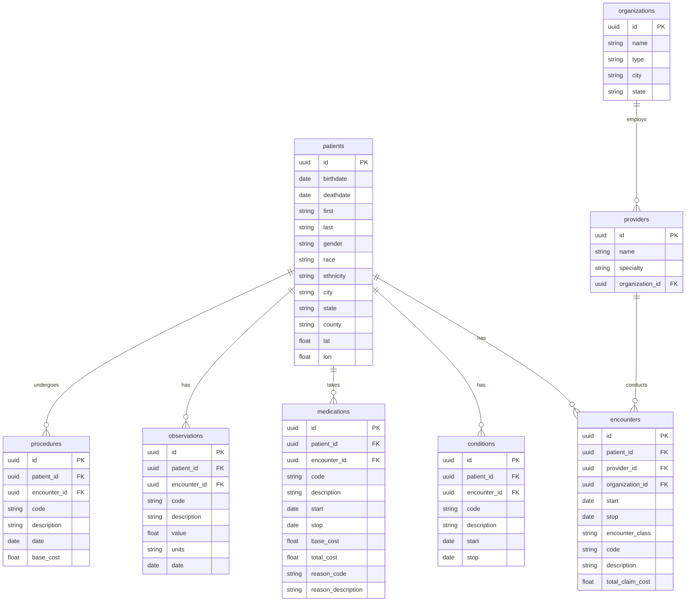
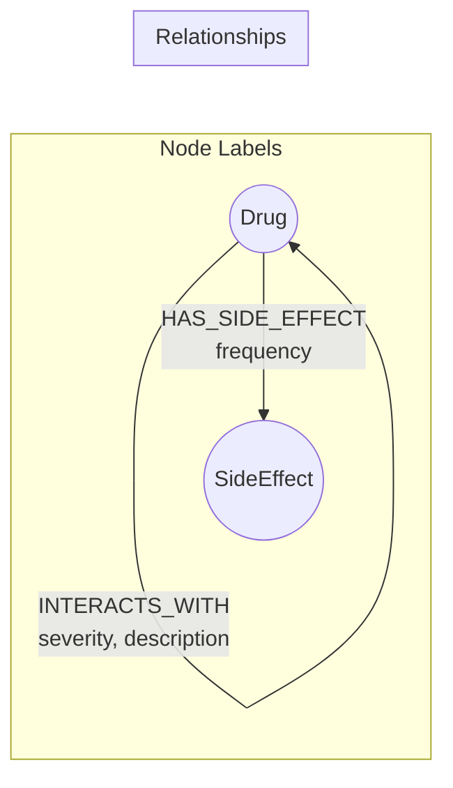

# Clinical Decision-Support Tool for Drug Safety

A multi-model database application that checks drug safety when prescribing a new medication by integrating **PostgreSQL**, **Neo4j**, and **Qdrant**.

---

## Project Description

Our group is building a clinical decision-support tool for drug safety and recommendation by integrating three complementary database systems, each selected for the type of question it answers best.

- **PostgreSQL** (relational) stores structured patient and prescription data generated from [Synthea](https://synthetichealth.github.io/synthea/), enabling reliable queries such as identifying a patient's current active medications with strong consistency and ACID guarantees.
- **Neo4j** (graph) represents drug–drug interactions and drug–side-effect relationships from the [NLM RxNav Interaction API](https://lhncbc.nlm.nih.gov/RxNav/APIs/InteractionAPIs.html) and [SIDER](http://sideeffects.embl.de/) as nodes and edges, allowing efficient graph traversals to detect unsafe combinations and identify alternative drugs within the same therapeutic space.
- **Qdrant** (vector) supports similarity search over embedded patient profiles and real-world adverse event reports from [openFDA FAERS](https://open.fda.gov/apis/), making it possible to identify clinically similar patients and surface relevant adverse reactions or well-tolerated alternatives based on semantic similarity rather than exact matches.

Together, the relational database ensures an accurate patient medication state, the graph database captures complex biomedical relationships, and the vector database enables patient similarity and evidence-based risk assessment — demonstrating how multi-model data systems can jointly support safer and more informed prescribing decisions.

---

## Use Case: Comprehensive Drug Safety Check

**Problem:** When a clinician prescribes a new medication, the system must (1) retrieve the patient's current drugs, (2) check for dangerous drug–drug interactions and known side effects, and (3) find clinically similar patients who experienced adverse events with the proposed drug — all in real time.

**Combined Result Example:**

> **WARNING:** Lisinopril has a **MAJOR** interaction with the patient's current Potassium Chloride (risk of hyperkalemia). Additionally, **4 patients** with similar profiles (age 68+, diabetic, on ACE inhibitors) reported persistent dry cough. **Recommendation:** Consider an ARB alternative (e.g., Losartan) or monitor potassium levels closely.

### Query Flow

```
  Clinician input: Patient ID + Proposed Drug
                       │
       ┌───────────────┼───────────────┐
       ▼               ▼               ▼
  ┌─────────┐    ┌──────────┐    ┌──────────┐
  │PostgreSQL│    │  Neo4j   │    │  Qdrant  │
  │          │    │          │    │          │
  │ Step 1:  │    │ Step 2:  │    │ Step 3:  │
  │ Current  │───▶│ Check    │    │ Similar  │
  │ meds for │    │ drug–drug│    │ patients │
  │ patient  │    │ interact-│    │ with     │
  │          │    │ ions &   │    │ adverse  │
  │          │    │ side     │    │ events   │
  │          │    │ effects  │    │          │
  └─────────┘    └──────────┘    └──────────┘
       │               │               │
       └───────────────┼───────────────┘
                       ▼
              ┌─────────────────┐
              │  Combined Drug  │
              │  Safety Report  │
              └─────────────────┘
```

| Step | Database | Query | Purpose |
|------|----------|-------|---------|
| 1 | **PostgreSQL** | `SELECT * FROM medications WHERE patient_id = $pid AND stop IS NULL` | Retrieve patient's current active medications |
| 2a | **Neo4j** | `MATCH (d1:Drug)-[i:INTERACTS_WITH]->(d2:Drug) WHERE d1.name IN $current_meds AND d2.name = $new_drug RETURN d1.name, i.severity, i.description` | Detect drug–drug interactions and severity |
| 2b | **Neo4j** | `MATCH (d:Drug {name: $new_drug})-[:HAS_SIDE_EFFECT]->(se:SideEffect) RETURN se.name, se.frequency` | Retrieve known side effects for the proposed drug |
| 3 | **Qdrant** | `search(collection='adverse_events', vector=patient_profile_embedding, filter={drug: $new_drug}, top_k=10)` | Find similar patients who had adverse events with this drug |

### Why All Three Databases Are Required

| Question | Best Answered By | Why Not the Others? |
|----------|-----------------|---------------------|
| What medications is the patient currently taking? | **PostgreSQL** | ACID guarantees, exact filters, JOINs on structured EHR data |
| Does Drug A interact with Drug B? What are the side effects? | **Neo4j** | Drug–drug and drug–side-effect relationships are naturally a graph; SQL would need complex self-joins and recursive CTEs |
| Which similar patients had adverse reactions to this drug? | **Qdrant** | Requires vector similarity (k-NN) over high-dimensional patient embeddings; not possible in relational or graph DBs |

---

## Architecture

```
┌──────────────────────────────────────────────────────────────────────┐
│                          DATA SOURCES                                │
│                                                                      │
│  Synthea ──────────┐   RxNav API ──────┐   SIDER ──────┐            │
│  (patients, meds,  │   (drug–drug      │   (drug side  │            │
│   conditions,      │    interactions)   │    effects)   │            │
│   encounters)      │                   │               │            │
│                    │   openFDA FAERS ───┤               │            │
│                    │   (adverse event   │               │            │
│                    │    reports)        │               │            │
└────────┬───────────┴─────────┬─────────┴───────┬───────┘            │
         │                     │                 │                     │
         ▼                     ▼                 ▼                     │
  ┌─────────────┐      ┌─────────────┐    ┌─────────────┐             │
  │ PostgreSQL  │      │   Neo4j     │    │   Qdrant    │             │
  │             │      │             │    │             │             │
  │ patients    │      │ (:Drug)     │    │ adverse_    │             │
  │ encounters  │      │ (:SideEffect│    │  events     │             │
  │ conditions  │      │ (:Drug)-    │    │  [vec(384)] │             │
  │ medications │      │  [:INTERACTS│    │             │             │
  │ observations│      │   _WITH]->  │    │ patient_    │             │
  │ procedures  │      │  (:Drug)    │    │  profiles   │             │
  │ providers   │      │ (:Drug)-    │    │  [vec(384)] │             │
  │ organizations      │  [:HAS_SIDE │    │             │             │
  │             │      │   _EFFECT]->│    │             │             │
  │             │      │  (:SideEff) │    │             │             │
  └──────┬──────┘      └──────┬──────┘    └──────┬──────┘             │
         │                    │                  │                     │
         └────────────────────┼──────────────────┘                     │
                              ▼                                        │
                    ┌──────────────────┐                               │
                    │   Application    │                               │
                    │  (Python / API)  │                               │
                    └──────────────────┘                               │
```

---

## Data Sources

| Source | URL | License | What It Provides | Database Target |
|--------|-----|---------|------------------|-----------------|
| **Synthea** | https://synthetichealth.github.io/synthea/ | Apache 2.0 | Synthetic EHR: patients, encounters, conditions, medications, observations, procedures | PostgreSQL |
| **NLM RxNav Interaction API** | https://lhncbc.nlm.nih.gov/RxNav/APIs/InteractionAPIs.html | Public Domain | Drug–drug interaction pairs with severity and descriptions (sourced from ONCHigh and DrugBank via public API) | Neo4j |
| **SIDER** | http://sideeffects.embl.de/ | CC BY-NC-SA | Drug–side-effect pairs with frequency data | Neo4j |
| **openFDA FAERS** | https://open.fda.gov/apis/drug/event.json | Public Domain | Real-world adverse event reports (patient demographics, drugs, reactions) | Qdrant |

### Why RxNav Instead of DrugBank Directly?

DrugBank's full dataset requires a licensed academic account (approval takes ~5 business days). The NLM RxNav Interaction API exposes the same drug–drug interaction data through a **free, public, no-registration REST API**. It uses RxNorm concept identifiers (RxCUIs), which align directly with the medication codes Synthea generates — making the ETL pipeline seamless.

```bash
# Example: get all interactions for Warfarin (RxCUI 11289)
curl "https://rxnav.nlm.nih.gov/REST/interaction/interaction.json?rxcui=11289"

# Example: check interaction between two specific drugs
curl "https://rxnav.nlm.nih.gov/REST/interaction/list.json?rxcuis=88014+11289"
```

---

## Database Schemas

### PostgreSQL (Relational)

Stores normalized patient records from Synthea CSV exports.



**Key query for Use Case 1:**

```sql
SELECT m.code, m.description, m.start, m.stop
FROM medications m
WHERE m.patient_id = $patient_id
  AND m.stop IS NULL
ORDER BY m.start DESC;
```

---

### Neo4j (Graph)

Stores drug interaction and side-effect relationships as a traversable graph.



**Node properties:**

| Node | Properties |
|------|-----------|
| `Drug` | `rxcui` (RxNorm ID), `name`, `category` |
| `SideEffect` | `name`, `meddra_id` |

**Relationship properties:**

| Relationship | Properties | Source |
|-------------|-----------|--------|
| `INTERACTS_WITH` | `severity` (major/moderate/minor), `description` | RxNav API |
| `HAS_SIDE_EFFECT` | `frequency` (very common/common/uncommon/rare) | SIDER |

**Key queries for Use Case 1:**

```cypher
// Check drug–drug interactions between current meds and proposed drug
MATCH (d1:Drug)-[i:INTERACTS_WITH]->(d2:Drug)
WHERE d1.name IN $current_medications
  AND d2.name = $proposed_drug
RETURN d1.name AS current_drug,
       i.severity,
       i.description

// Get known side effects of the proposed drug
MATCH (d:Drug {name: $proposed_drug})-[r:HAS_SIDE_EFFECT]->(se:SideEffect)
RETURN se.name, r.frequency
ORDER BY CASE r.frequency
  WHEN 'very_common' THEN 1
  WHEN 'common' THEN 2
  WHEN 'uncommon' THEN 3
  WHEN 'rare' THEN 4
END
```

---

### Qdrant (Vector)

Stores embedded patient profiles and adverse event reports for similarity search.

| Collection | Vector Dimension | Payload Fields | Purpose |
|------------|-----------------|----------------|---------|
| `adverse_events` | 384 | `drug`, `reactions[]`, `patient_age`, `patient_sex`, `patient_conditions[]`, `outcome`, `report_date`, `source_id` | Find similar patients who experienced adverse events with a specific drug |
| `patient_profiles` | 384 | `patient_id`, `age`, `gender`, `conditions[]`, `medications[]`, `observation_summary` | Retrieve clinically similar patient profiles for risk comparison |

**Embedding model:** `all-MiniLM-L6-v2` (384-dimensional, from `sentence-transformers`)

**How embeddings are created:**

- **Adverse events:** Each openFDA FAERS report is serialized into a text summary (age, sex, conditions, drug, reaction, outcome) and embedded.
- **Patient profiles:** Each Synthea patient's demographics, active conditions, and current medications are concatenated into a text representation and embedded.

**Key query for Use Case 1:**

```python
from qdrant_client import QdrantClient
from sentence_transformers import SentenceTransformer

model = SentenceTransformer('all-MiniLM-L6-v2')

patient_summary = "68 year old male, diabetes mellitus type 2, hypertension, currently taking metformin and lisinopril"
query_vector = model.encode(patient_summary).tolist()

results = qdrant.search(
    collection_name="adverse_events",
    query_vector=query_vector,
    query_filter={"must": [{"key": "drug", "match": {"value": "warfarin"}}]},
    limit=10
)
```

```
Qdrant collections (Use Case 1)
├── adverse_events     [vector(384)] + payload(drug, reactions, patient_age, ...)
└── patient_profiles   [vector(384)] + payload(patient_id, conditions, medications, ...)
```

---

## ETL Pipeline Overview

```
┌──────────────┐     ┌──────────────┐     ┌──────────────┐     ┌──────────────┐
│   Synthea    │     │  RxNav API   │     │    SIDER     │     │ openFDA FAERS│
│  (CSV files) │     │  (REST/JSON) │     │ (TSV files)  │     │  (REST/JSON) │
└──────┬───────┘     └──────┬───────┘     └──────┬───────┘     └──────┬───────┘
       │                    │                    │                    │
       ▼                    ▼                    ▼                    ▼
┌──────────────┐     ┌──────────────┐     ┌──────────────┐     ┌──────────────┐
│ load_synthea │     │ load_rxnav   │     │ load_sider   │     │ load_faers   │
│   _to_pg.py  │     │ _to_neo4j.py │     │ _to_neo4j.py │     │ _to_qdrant.py│
└──────┬───────┘     └──────┬───────┘     └──────┬───────┘     └──────┬───────┘
       │                    │                    │                    │
       ▼                    └─────────┬──────────┘                   ▼
  PostgreSQL                       Neo4j                          Qdrant
```

### Step 1: Generate Synthetic Patients (Synthea)

```bash
git clone https://github.com/synthetichealth/synthea.git
cd synthea
./run_synthea -p 1000 --exporter.csv.export=true
# Output: output/csv/*.csv (patients, medications, conditions, encounters, ...)
```

### Step 2: Fetch Drug Interactions (RxNav API)

```bash
# For each unique medication code from Synthea medications.csv,
# query the RxNav Interaction API:
curl "https://rxnav.nlm.nih.gov/REST/interaction/interaction.json?rxcui=<RXCUI>"
```

### Step 3: Download Side Effects (SIDER)

```bash
# SIDER data files (freely downloadable, no registration)
wget http://sideeffects.embl.de/media/download/meddra_all_se.tsv.gz
gunzip meddra_all_se.tsv.gz
```

### Step 4: Fetch Adverse Events (openFDA FAERS)

```bash
# Pull adverse event reports (public API, no key required for <1000/day)
curl "https://api.fda.gov/drug/event.json?limit=1000" > faers_events.json

# For higher volume, register for a free API key:
# https://open.fda.gov/apis/authentication/
```

---

## Tech Stack

| Component | Technology |
|-----------|-----------|
| Language | Python 3.10+ |
| Relational DB | PostgreSQL 15+ |
| Graph DB | Neo4j 5+ (Community Edition) |
| Vector DB | Qdrant (Docker or Cloud) |
| Embeddings | `sentence-transformers` (`all-MiniLM-L6-v2`) |
| PostgreSQL driver | `psycopg2` |
| Neo4j driver | `neo4j` (official Python driver) |
| Qdrant driver | `qdrant-client` |
| HTTP / API calls | `requests` |

---

## Quick Start

### Prerequisites

```bash
# PostgreSQL, Neo4j, Qdrant running (e.g., via Docker)
docker run -d --name postgres -p 5432:5432 -e POSTGRES_PASSWORD=pass postgres:15
docker run -d --name neo4j -p 7474:7474 -p 7687:7687 -e NEO4J_AUTH=neo4j/password neo4j:5-community
docker run -d --name qdrant -p 6333:6333 qdrant/qdrant
```

### Install Python Dependencies

```bash
pip install psycopg2-binary neo4j qdrant-client sentence-transformers requests pandas
```

### Run ETL

```bash
# 1. Load Synthea CSVs into PostgreSQL
python etl/load_synthea_to_pg.py --csv-dir ./synthea/output/csv

# 2. Fetch drug interactions from RxNav and load into Neo4j
python etl/load_rxnav_to_neo4j.py

# 3. Load SIDER side effects into Neo4j
python etl/load_sider_to_neo4j.py --file ./data/meddra_all_se.tsv

# 4. Fetch openFDA FAERS data, embed, and load into Qdrant
python etl/load_faers_to_qdrant.py
```

### Run Drug Safety Check

```bash
python app/drug_safety_check.py --patient-id <UUID> --proposed-drug "Warfarin"
```

---

## Project Requirements Compliance

| Requirement | Status | Where Satisfied |
|-------------|--------|-----------------|
| At least one relational database element | Yes | PostgreSQL stores patients, medications, conditions, encounters, observations, procedures |
| At least one graph data element | Yes | Neo4j stores drug–drug interactions (RxNav) and drug–side-effect relationships (SIDER) |
| Frame project: what your tool does and why | Yes | Project Description section; Use Case section with problem statement and combined result |
| Clear explanations of database structures and why | Yes | Database Schemas section with justification per database |
| How structures fit into the purpose of the tool | Yes | Query Flow table maps each step to a database with purpose |
| Showcase use cases and how they utilize the databases | Yes | Detailed Use Case with step-by-step queries across all three databases |
| Visualizations of the schemas of your databases | Yes | Mermaid ER diagram (PostgreSQL), flowchart (Neo4j), collection table (Qdrant) |
| Third database (vector/NoSQL) for extra credit, justified | Yes | See justification below |

### Database Selection Justification

**PostgreSQL (relational):**
Patient and medication records are inherently tabular and relational. We need ACID transactions to guarantee that a patient's medication list is accurate at query time. SQL JOINs and WHERE filters give us exact lookups ("all active medications for patient X") that graph and vector databases are not optimized for.

**Neo4j (graph):**
Drug–drug interactions form a natural graph: drugs are nodes, interactions are edges with severity attributes. Checking whether any of a patient's N current medications interact with a proposed drug is a single graph traversal — the same query in SQL would require a self-join on a large interaction table. Side effects are similarly modeled as `(:Drug)-[:HAS_SIDE_EFFECT]->(:SideEffect)` edges, enabling efficient multi-hop queries like "find all drugs that share side effects with Drug X."

**Qdrant (vector) — extra credit justification:**
Neither PostgreSQL nor Neo4j can answer "find patients clinically similar to this one." Qdrant stores 384-dimensional embeddings of patient profiles and adverse event reports, enabling k-nearest-neighbor retrieval based on semantic similarity. This surfaces real-world evidence (e.g., "patients like yours who took Warfarin reported bleeding") that structured queries cannot capture. Removing Qdrant would eliminate the evidence-based risk assessment capability entirely.

| Database | Answers | Cannot Do |
|----------|---------|-----------|
| **PostgreSQL** | "What are the facts?" — exact records, filters, aggregates | Semantic similarity, graph traversal |
| **Neo4j** | "How are things connected?" — interactions, paths, networks | Aggregations at scale, similarity search |
| **Qdrant** | "What is similar?" — similar patients, similar adverse events | Structured queries, relationship traversal |

---

## Team Assignments

The project is split into **5 parts** across the team. Parts 2 and 3 both target Neo4j but handle different data sources independently. Parts are listed below from most to least critical thinking required.

```
┌──────────────────────────────────────────────────────────────────────────┐
│                           TEAM WORKFLOW                                  │
│                                                                          │
│  Part 1           Part 2           Part 3          Part 4       Part 5   │
│  (PostgreSQL)     (Neo4j:DDI)      (Neo4j:SE)      (Qdrant)     (App)   │
│       │               │               │               │           │      │
│       ▼               ▼               ▼               ▼           │      │
│  Synthea CSV      RxNav API       SIDER TSV      openFDA FAERS   │      │
│       │               │               │               │           │      │
│       ▼               ▼               ▼               ▼           │      │
│  load_synthea     load_rxnav      load_sider     load_faers      │      │
│   _to_pg.py       _to_neo4j.py    _to_neo4j.py   _to_qdrant.py  │      │
│       │               │               │               │           │      │
│       ▼               ▼               ▼               ▼           │      │
│  PostgreSQL       Neo4j (DDI)     Neo4j (SE)       Qdrant         │      │
│       │               │               │               │           │      │
│       ▼               ▼               ▼               ▼           │      │
│  pg_queries.py    neo4j_          neo4j_          qdrant_         │      │
│                   interactions.py side_effects.py queries.py      │      │
│       │               │               │               │           │      │
│       └───────────────┴───────────────┴───────────────┘           │      │
│                               ▼                                   │      │
│                      drug_safety_check.py  ◄──────────────────────┘      │
│                      (calls all four modules)                            │
└──────────────────────────────────────────────────────────────────────────┘
```

### Critical Thinking Required (high → low)

| Rank | Part | Why |
|------|------|-----|
| 1 | **Part 4 — Qdrant + openFDA FAERS** | Design how to serialize clinical data into text, choose/justify embeddings, define what "similar" means clinically, set filters, pick vector metrics, validate that similarity results are meaningful. Lots of modeling and experimentation. |
| 2 | **Part 2 — Neo4j + RxNav (Drug Interactions)** | Careful graph modeling (Drug nodes, interaction edges, properties), mapping RxNav's JSON to a stable schema, handling duplicates/inconsistencies, designing queries that correctly reflect clinical severity and directionality. |
| 3 | **Part 5 — Application & Integration** | Orchestrate all pieces, define a clean interface contract, handle failures/latency, and turn raw outputs into a coherent, clinically sensible safety report and recommendation strategy. |
| 4 | **Part 3 — Neo4j + SIDER (Side Effects)** | Schema design and mapping from SIDER's MedDRA codes to drugs, designing useful side-effect queries and frequency ordering. Conceptually similar to Part 2 but more lookup-style. |
| 5 | **Part 1 — PostgreSQL + Synthea** | Mostly straightforward relational modeling and ETL from well-structured CSVs. Still important, but more implementation and less conceptual/methodological choice. |

---

### Part 1 — PostgreSQL + Synthea (Patient Data)

**Owns:** Synthea data generation, PostgreSQL schema, ETL, and query layer

**Data source:** [Synthea](https://synthetichealth.github.io/synthea/) (Apache 2.0)

**Deliverables:**

| File | Description |
|------|-------------|
| `etl/load_synthea_to_pg.py` | Generate Synthea patients, parse CSVs, create tables, bulk-load into PostgreSQL |
| `db/pg_queries.py` | Query functions that other parts call |
| `db/pg_schema.sql` | DDL for all PostgreSQL tables |

**Tasks:**

1. Install and run Synthea to generate ~1,000 synthetic patients (`./run_synthea -p 1000 --exporter.csv.export=true`)
2. Design and create the PostgreSQL schema (tables: `patients`, `medications`, `conditions`, `encounters`, `observations`, `procedures`, `providers`, `organizations`)
3. Write the ETL script to parse Synthea CSVs and bulk-insert into PostgreSQL
4. Expose query functions with these signatures:

```python
# db/pg_queries.py

def get_active_medications(patient_id: str) -> list[dict]:
    """
    Returns list of active medications for a patient.
    Each dict: {code, description, start_date, reason_code, reason_description}
    """

def get_patient_profile(patient_id: str) -> dict:
    """
    Returns patient demographics + conditions + active meds as a single dict.
    Used by Part 4 to build the embedding text.
    """
```

**Schema to create:**

```sql
-- db/pg_schema.sql
CREATE TABLE patients (
    id UUID PRIMARY KEY,
    birthdate DATE,
    deathdate DATE,
    first VARCHAR, last VARCHAR,
    gender VARCHAR, race VARCHAR, ethnicity VARCHAR,
    city VARCHAR, state VARCHAR, county VARCHAR,
    lat FLOAT, lon FLOAT
);

CREATE TABLE medications (
    id UUID PRIMARY KEY,
    patient_id UUID REFERENCES patients(id),
    encounter_id UUID,
    code VARCHAR,
    description VARCHAR,
    start DATE, stop DATE,
    base_cost FLOAT, total_cost FLOAT,
    reason_code VARCHAR, reason_description VARCHAR
);

-- conditions, encounters, observations, procedures, providers, organizations
-- (follow same pattern from Synthea CSV column headers)
```

5. Write the PostgreSQL section of the final report

---

### Part 2 — Neo4j + RxNav (Drug–Drug Interactions)

**Owns:** Drug interaction graph, RxNav ETL, and interaction query layer

**Data source:** [NLM RxNav Interaction API](https://lhncbc.nlm.nih.gov/RxNav/APIs/InteractionAPIs.html) (Public Domain)

**Deliverables:**

| File | Description |
|------|-------------|
| `etl/load_rxnav_to_neo4j.py` | Fetch drug interactions from RxNav API, create Drug nodes and INTERACTS_WITH edges |
| `db/neo4j_interactions.py` | Interaction query functions that other parts call |

**Tasks:**

1. Extract unique medication RxNorm codes from Synthea's `medications.csv` (coordinate with Part 1)
2. For each RxCUI, call the RxNav Interaction API and collect interaction pairs with severity
3. Map RxNav JSON responses into a stable graph schema — handle duplicates, bidirectional edges, and inconsistent severity labels
4. Create Drug nodes and INTERACTS_WITH relationships in Neo4j
5. Expose query functions with these signatures:

```python
# db/neo4j_interactions.py

def check_interactions(current_med_names: list[str], proposed_drug: str) -> list[dict]:
    """
    Returns list of interactions between current meds and proposed drug.
    Each dict: {current_drug, proposed_drug, severity, description}
    """
```

**RxNav API pattern:**

```bash
# Get interactions for a single drug by RxCUI
curl "https://rxnav.nlm.nih.gov/REST/interaction/interaction.json?rxcui=11289"

# Get interactions between two drugs
curl "https://rxnav.nlm.nih.gov/REST/interaction/list.json?rxcuis=88014+11289"
```

**Neo4j schema (interactions):**

```cypher
CREATE CONSTRAINT FOR (d:Drug) REQUIRE d.rxcui IS UNIQUE;

MERGE (d1:Drug {rxcui: '11289', name: 'Warfarin'})
MERGE (d2:Drug {rxcui: '88014', name: 'Aspirin'})
MERGE (d1)-[:INTERACTS_WITH {severity: 'major', description: 'Increased bleeding risk'}]->(d2)
```

6. Write the drug interaction section of the final report

---

### Part 3 — Neo4j + SIDER (Drug Side Effects)

**Owns:** Side-effect data, SIDER ETL, and side-effect query layer

**Data source:** [SIDER](http://sideeffects.embl.de/) (CC BY-NC-SA)

**Deliverables:**

| File | Description |
|------|-------------|
| `etl/load_sider_to_neo4j.py` | Parse SIDER TSV, create SideEffect nodes and HAS_SIDE_EFFECT edges |
| `db/neo4j_side_effects.py` | Side-effect query functions that other parts call |

**Tasks:**

1. Download SIDER `meddra_all_se.tsv` (drug–side-effect pairs with MedDRA codes)
2. Map SIDER drug identifiers (PubChem/STITCH) to RxNorm/drug names so they link to the same Drug nodes Part 2 creates
3. Create SideEffect nodes and HAS_SIDE_EFFECT relationships with frequency data
4. Design frequency ordering (very common > common > uncommon > rare)
5. Expose query functions with these signatures:

```python
# db/neo4j_side_effects.py

def get_side_effects(drug_name: str) -> list[dict]:
    """
    Returns known side effects for a drug, ordered by frequency.
    Each dict: {side_effect, meddra_id, frequency}
    """
```

**SIDER download:**

```bash
wget http://sideeffects.embl.de/media/download/meddra_all_se.tsv.gz
gunzip meddra_all_se.tsv.gz
```

**Neo4j schema (side effects):**

```cypher
CREATE CONSTRAINT FOR (se:SideEffect) REQUIRE se.meddra_id IS UNIQUE;

MERGE (d:Drug {name: 'Aspirin'})
MERGE (se:SideEffect {meddra_id: 'C0018681', name: 'Headache'})
MERGE (d)-[:HAS_SIDE_EFFECT {frequency: 'common'}]->(se)
```

**Coordination with Part 2:** Both parts write to the same Neo4j database. Part 2 creates Drug nodes; Part 3 reuses them via `MERGE` on name/rxcui. Agree on the Drug node key property (`rxcui` or `name`) upfront.

6. Write the side effects section of the final report

---

### Part 4 — Qdrant + openFDA FAERS (Adverse Events & Similarity)

**Owns:** Adverse event ingestion, embedding pipeline, Qdrant collections, and similarity query layer

**Data source:** [openFDA FAERS API](https://open.fda.gov/apis/drug/event.json) (Public Domain)

**Deliverables:**

| File | Description |
|------|-------------|
| `etl/load_faers_to_qdrant.py` | Fetch FAERS reports from openFDA, embed with sentence-transformers, upsert into Qdrant |
| `db/qdrant_queries.py` | Similarity query functions that other parts call |

**Key design decisions (this is where the critical thinking lives):**

| Decision | Options to Evaluate |
|----------|-------------------|
| **Text serialization** | How to turn structured FAERS JSON (age, sex, drugs, reactions, outcome) into a text string that embeds well. Order of fields, level of detail, and inclusion of medical codes vs. plain text all affect embedding quality. |
| **Embedding model** | `all-MiniLM-L6-v2` (384-dim, fast) vs. `all-mpnet-base-v2` (768-dim, higher quality) vs. domain-specific clinical models. Trade-off: speed/size vs. clinical accuracy. |
| **Similarity metric** | Cosine vs. Euclidean vs. Dot product. Cosine is standard for sentence embeddings but validate empirically. |
| **Filtering strategy** | Filter by drug name before or after similarity search. Pre-filtering (Qdrant payload filter) is faster; post-filtering gives broader results. |
| **Validation** | How to verify that "similar" patients are actually clinically similar — spot-check top-k results, compare demographics, check if returned adverse events are clinically plausible. |

**Tasks:**

1. Fetch adverse event reports from the openFDA FAERS API (paginate to collect ~5,000–10,000 reports)
2. Design the text serialization format — experiment with different orderings and detail levels
3. Choose and justify the embedding model (benchmark on sample queries)
4. Create Qdrant collections (`adverse_events`, `patient_profiles`) and upsert vectors with payloads
5. Build patient profile embeddings from Synthea data (coordinate with Part 1 for `get_patient_profile()`)
6. Validate similarity results — are the top-k patients actually clinically similar?
7. Expose query functions with these signatures:

```python
# db/qdrant_queries.py

def find_similar_adverse_events(patient_summary: str, drug_name: str, top_k: int = 10) -> list[dict]:
    """
    Finds FAERS reports from similar patients who had adverse events with this drug.
    Returns list of dicts: {patient_age, patient_sex, reactions, outcome, similarity_score}
    """

def find_similar_patients(patient_summary: str, top_k: int = 10) -> list[dict]:
    """
    Finds similar patient profiles from the Synthea dataset.
    Returns list of dicts: {patient_id, conditions, medications, similarity_score}
    """
```

**openFDA API pattern:**

```bash
# Fetch adverse events for a specific drug
curl "https://api.fda.gov/drug/event.json?search=patient.drug.openfda.generic_name:warfarin&limit=100"

# General adverse events
curl "https://api.fda.gov/drug/event.json?limit=1000"
```

**Qdrant collection setup:**

```python
from qdrant_client import QdrantClient
from qdrant_client.models import Distance, VectorParams

client = QdrantClient(host="localhost", port=6333)

client.create_collection(
    collection_name="adverse_events",
    vectors_config=VectorParams(size=384, distance=Distance.COSINE),
)

client.create_collection(
    collection_name="patient_profiles",
    vectors_config=VectorParams(size=384, distance=Distance.COSINE),
)
```

8. Write the Qdrant/similarity section of the final report

---

### Part 5 — Application & Integration (Unified Drug Safety Check)

**Owns:** The main application that ties all three databases together, plus documentation and demo

**Deliverables:**

| File | Description |
|------|-------------|
| `app/drug_safety_check.py` | Main application that orchestrates queries across all 3 databases |
| `app/config.py` | Database connection settings |
| `requirements.txt` | All Python dependencies |
| Report / slides | Final write-up and presentation |

**Tasks:**

1. Write `requirements.txt` with all project dependencies
2. Write `config.py` with connection settings for all three databases
3. Build the main `drug_safety_check.py` that:
   - Takes a `patient_id` and `proposed_drug` as input
   - Calls `pg_queries.get_active_medications()` (Part 1)
   - Calls `neo4j_interactions.check_interactions()` (Part 2)
   - Calls `neo4j_side_effects.get_side_effects()` (Part 3)
   - Calls `qdrant_queries.find_similar_adverse_events()` (Part 4)
   - Combines results into a unified safety report
4. Format the combined output (console, JSON, or simple web UI)
5. Handle edge cases: no interactions found, no similar patients, API timeouts
6. Coordinate the final report and presentation

```python
# app/drug_safety_check.py  (skeleton)

from db.pg_queries import get_active_medications, get_patient_profile
from db.neo4j_interactions import check_interactions
from db.neo4j_side_effects import get_side_effects
from db.qdrant_queries import find_similar_adverse_events

def run_safety_check(patient_id: str, proposed_drug: str) -> dict:
    # Step 1 — PostgreSQL: get current medications
    active_meds = get_active_medications(patient_id)
    med_names = [m["description"] for m in active_meds]

    # Step 2a — Neo4j: check drug–drug interactions
    interactions = check_interactions(med_names, proposed_drug)

    # Step 2b — Neo4j: get side effects
    side_effects = get_side_effects(proposed_drug)

    # Step 3 — Qdrant: find similar patients with adverse events
    profile = get_patient_profile(patient_id)
    patient_summary = build_summary_text(profile)
    similar_events = find_similar_adverse_events(patient_summary, proposed_drug)

    return {
        "patient_id": patient_id,
        "proposed_drug": proposed_drug,
        "current_medications": med_names,
        "interactions": interactions,
        "side_effects": side_effects,
        "similar_adverse_events": similar_events,
        "recommendation": generate_recommendation(interactions, similar_events),
    }
```

---

### Interface Contract (How the Parts Connect)

All four query modules expose functions with agreed-upon signatures. Part 5's app calls them in sequence:

```
Part 1                 Part 2                    Part 3                  Part 4
pg_queries.py          neo4j_interactions.py     neo4j_side_effects.py   qdrant_queries.py
─────────────          ──────────────────────    ─────────────────────   ─────────────────
get_active_            check_interactions()      get_side_effects()      find_similar_
 medications()           → list[dict]              → list[dict]          adverse_events()
  → list[dict]           {current_drug,            {side_effect,           → list[dict]
  {code,                  proposed_drug,            meddra_id,             {patient_age,
   description,           severity,                 frequency}              patient_sex,
   start_date,            description}                                      reactions,
   reason_code,                                                             outcome,
   reason_description}                                                      similarity_score}

get_patient_profile()                                                   find_similar_patients()
  → dict                                                                  → list[dict]
  {patient_id, age,                                                       {patient_id,
   gender, conditions[],                                                   conditions,
   medications[]}                                                          medications,
                                                                           similarity_score}
         │                    │                     │                         │
         └────────────────────┴─────────────────────┴─────────────────────────┘
                                          ▼
                              Part 5: drug_safety_check.py
                              calls all four modules, merges results
```

---

### Parallel Work Timeline

| Week | Part 1 (PostgreSQL) | Part 2 (Neo4j: DDI) | Part 3 (Neo4j: SE) | Part 4 (Qdrant) | Part 5 (Integration) |
|------|--------------------|--------------------|--------------------|-----------------|--------------------|
| 1 | Run Synthea, design PG schema, write DDL | Explore RxNav API, design interaction graph schema | Download SIDER, explore MedDRA mapping | Explore openFDA API, test embedding models, design serialization | Write `config.py`, `requirements.txt`, stub out `drug_safety_check.py` |
| 2 | Write & test `load_synthea_to_pg.py` | Write & test `load_rxnav_to_neo4j.py` | Write & test `load_sider_to_neo4j.py` | Write & test `load_faers_to_qdrant.py`, experiment with embeddings | Test stubs with mock data |
| 3 | Write & test `pg_queries.py` | Write & test `neo4j_interactions.py` | Write & test `neo4j_side_effects.py` | Write & test `qdrant_queries.py`, validate similarity results | Integrate real query functions, end-to-end testing |
| 4 | Write PG section of report | Write DDI section of report | Write side effects section of report | Write Qdrant section of report | Finalize app, assemble report, build slides |

---

## Repository Structure

```
.
├── README.md                      # This file
├── requirements.txt               # Python dependencies              (Part 5)
├── etl/
│   ├── load_synthea_to_pg.py      # Synthea CSV → PostgreSQL         (Part 1)
│   ├── load_rxnav_to_neo4j.py     # RxNav API → Neo4j interactions   (Part 2)
│   ├── load_sider_to_neo4j.py     # SIDER TSV → Neo4j side effects   (Part 3)
│   └── load_faers_to_qdrant.py    # openFDA FAERS → Qdrant           (Part 4)
├── db/
│   ├── pg_schema.sql              # PostgreSQL DDL                    (Part 1)
│   ├── pg_queries.py              # PostgreSQL query functions        (Part 1)
│   ├── neo4j_interactions.py      # Neo4j interaction queries         (Part 2)
│   ├── neo4j_side_effects.py      # Neo4j side-effect queries         (Part 3)
│   └── qdrant_queries.py          # Qdrant similarity queries         (Part 4)
├── app/
│   ├── config.py                  # DB connection settings            (Part 5)
│   └── drug_safety_check.py       # Main app: unified safety check   (Part 5)
├── data/
│   └── meddra_all_se.tsv          # SIDER side effects                (Part 3)
└── synthea/
    └── output/csv/                # Generated Synthea CSVs            (Part 1)
```

---

## License

This project is developed for educational purposes as part of DSC 202.
