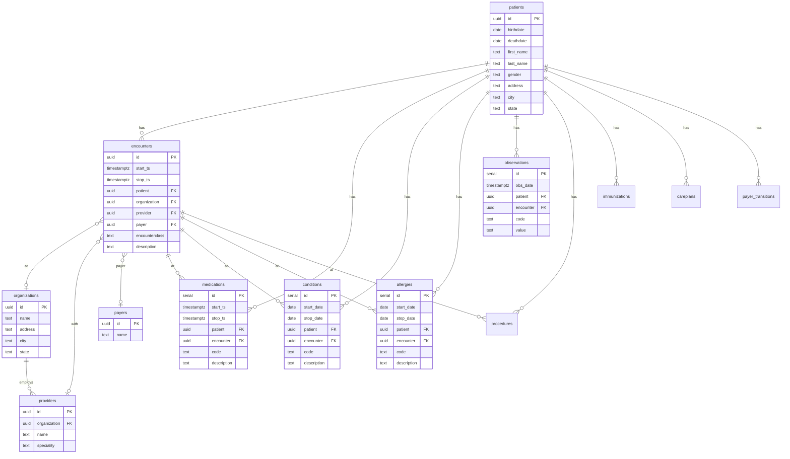
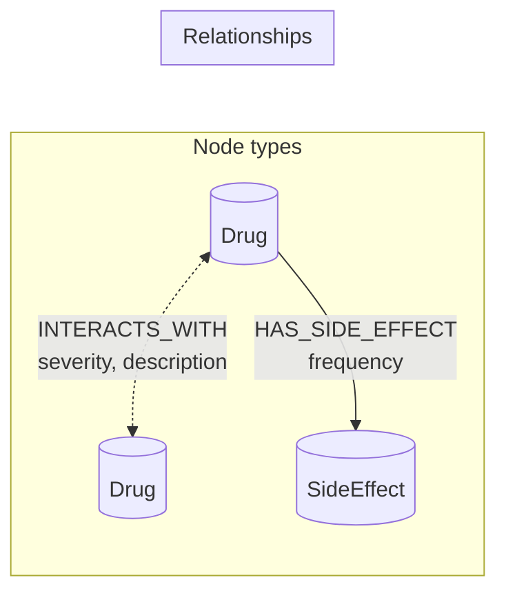
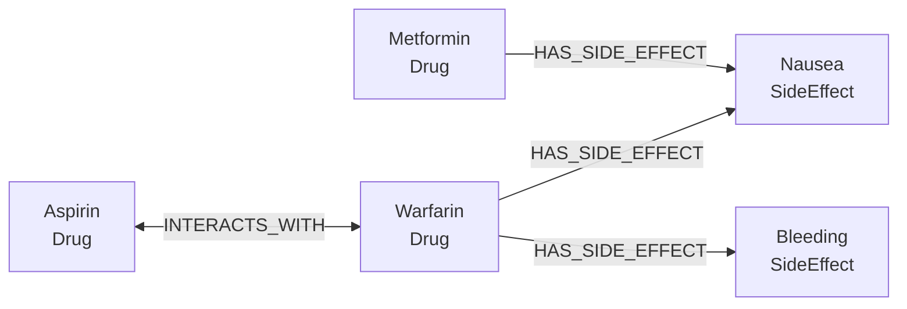
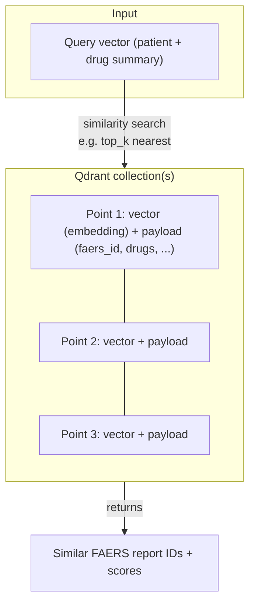
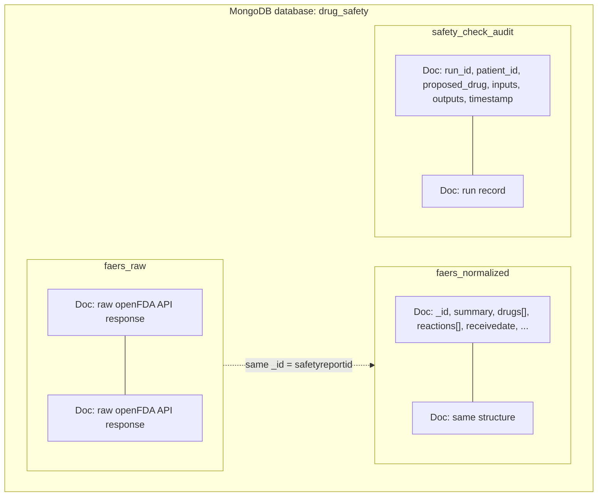
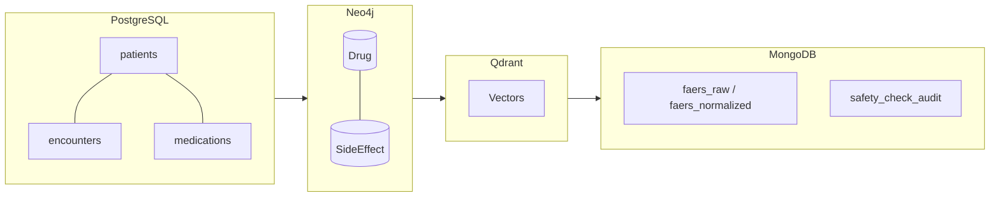

# Database Diagrams — Drug Safety & Recommendation

Diagrams for the four databases used in the project. View this file in a Markdown viewer that supports Mermaid (e.g. GitHub, VS Code with Mermaid extension), or open `database_diagrams.html` in a browser.

---

## 1. PostgreSQL (Relational) — Synthea patient data

**Role:** Patient state — demographics, encounters, active medications, conditions, allergies, observations. The schema supports both current-state queries (`get_patient_profile`, `get_active_medications`) and history/timeline queries (`get_medication_history`, `get_patient_timeline`) for richer context in MongoDB and the vector DB.

**Data source:** Synthea CSV exports.

Star schema: `patients` at the center; clinical events reference `patients` and often `encounters`.

---

## 2. Neo4j (Graph) — Drug interactions & side effects

**Role:** Drug–drug interactions and drug–side-effect relationships; graph traversals for safety checks.

**Data sources:** RxNav (interactions), SIDER (side effects).

**Nodes:** `Drug`, `SideEffect`. **Relationships:** `INTERACTS_WITH` (Drug–Drug), `HAS_SIDE_EFFECT` (Drug→SideEffect).

**Conceptual graph (example):**

---

## 3. Qdrant (Vector) — Similar adverse events

**Role:** Similarity search over embedded adverse event reports (and optionally patient summaries).

**Data source:** openFDA FAERS (often via normalized docs from MongoDB).

**Structure:** One or more collections; each point = vector (embedding) + payload (e.g. report id, drug names).

**Key idea:** Embeddings of FAERS report text (and/or patient context); query by vector to find “similar” real-world adverse events.

---

## 4. MongoDB (Document) — Evidence & audit

**Role:** Store raw FAERS documents, normalized summaries for embedding/lookup, and an audit log of each safety check.

**Collections:** Three main collections in database `drug_safety`.

**Collection summary:**

| Collection            | Purpose |
|-----------------------|--------|
| `faers_raw`           | Raw JSON from openFDA Drug Event API; `_id` = safetyreportid. Traceability. |
| `faers_normalized`    | Flattened doc (summary, drugs, reactions, dates) for embedding and evidence display; same `_id` for lookup. |
| `safety_check_audit`  | One document per safety-check run: inputs, outputs, timestamp (audit trail). |

---

## All four in one view

